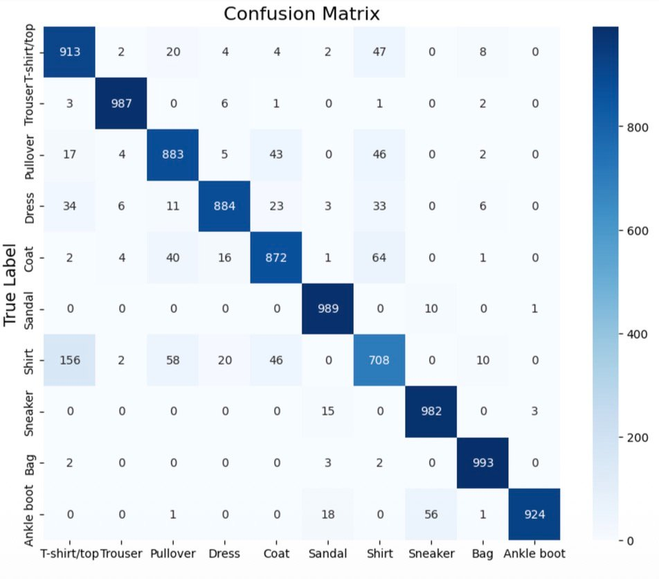
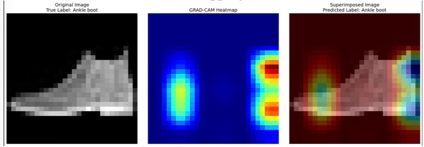

<div align="center">

# Fashion MNIST Classification

### _Deep CNN & Traditional ML — A Comparative Study_

**RAS598 · Fall 2024 · Arizona State University**

━━━━━━━━━━━━━━━━━━━━━━━━━━━━━━━━━━━

`Karan Athrey` · `Abhijit Sinha` · `Anusha Chatterjee`

[](#)&nbsp;
[](#)&nbsp;
[](#)&nbsp;
[](#)&nbsp;
[](#)

</div>

<br>

> **TL;DR** — We built 7 models to classify 70k fashion images into 10 categories. Our ResNet and CNN both hit **91% accuracy**, outperforming traditional ML baselines (83–89%). Grad-CAM confirms the models focus on the right visual features.

<br>

## ◈ What This Project Does

```
                    ┌─────────────────────────────────────────────┐
                    │          Fashion MNIST (70,000 images)       │
                    │          28×28 grayscale · 10 classes        │
                    └──────────────────┬──────────────────────────┘
                                       │
                         ┌─────────────┴─────────────┐
                         ▼                           ▼
                ┌─────────────────┐         ┌─────────────────┐
                │  Deep Learning  │         │  Traditional ML  │
                │  ─────────────  │         │  ─────────────── │
                │  • ResNet       │         │  • Logistic Reg  │
                │  • CNN          │         │  • SVM           │
                │                 │         │  • Random Forest │
                │                 │         │  • KNN           │
                │                 │         │  • MLP           │
                └────────┬────────┘         └────────┬────────┘
                         │                           │
                         └─────────────┬─────────────┘
                                       ▼
                            ┌─────────────────────┐
                            │  Compare & Analyze  │
                            │  Accuracy · F1 · CM │
                            │  Grad-CAM · Plotly  │
                            └─────────────────────┘
```

<br>

## ◈ The Dataset

Fashion MNIST serves as a modern replacement for the classic MNIST digits — same format, harder problem.

```
60,000 training images  ·  10,000 test images  ·  6,000 per class (balanced)
```

<table>
<tr>
<td width="50%">

| ID | Category | ID | Category |
|:--:|----------|:--:|----------|
| 0 | T-shirt/top | 5 | Sandal |
| 1 | Trouser | 6 | Shirt |
| 2 | Pullover | 7 | Sneaker |
| 3 | Dress | 8 | Bag |
| 4 | Coat | 9 | Ankle boot |

</td>
<td width="50%">

**Pixel Statistics**
```
Mean intensity   ■■■■■■░░░░░░░░░  72.94
Median intensity ░░░░░░░░░░░░░░░   0.00
Std deviation    ■■■■■■■░░░░░░░░  90.02
```
Most pixels are black (background) — normalization is essential.

</td>
</tr>
</table>

<br>

## ◈ Preprocessing Pipeline

```
 ① LOAD           ② NORMALIZE        ③ RESHAPE           ④ SPLIT
 ─────────        ───────────        ──────────          ─────────
 Load from        Pixel values       (28,28,1) for CNN   Train / Val
 Keras API        ÷ 255 → [0,1]     Flatten for ML      / Test sets
```

For traditional ML models, images are flattened from 28×28 matrices into 784-dimensional feature vectors.

<br>

## ◈ Model Architectures

<details>
<summary><b>🔷 ResNet — Residual Network</b> &nbsp;(click to expand)</summary>
<br>

```
Input(28×28×1)
  │
  ├─► Conv2D(32, 3×3, ReLU)
  ├─► MaxPooling2D(2×2)
  │
  ├─► ╔══ ResBlock ══╗
  │   ║ Conv2D(32)   ║
  │   ║ BatchNorm    ║
  │   ║ Conv2D(32)   ║──►(+)──► ReLU
  │   ║ BatchNorm    ║   ▲
  │   ╚══════════════╝   │
  │          skip ───────┘
  │
  ├─► MaxPooling2D(2×2)
  │
  ├─► ╔══ ResBlock ══╗
  │   ║ (same as     ║
  │   ║  above)      ║
  │   ╚══════════════╝
  │
  ├─► GlobalAveragePooling2D
  ├─► Flatten
  └─► Dense(10, Softmax)

Total params: 38,154 (148 KB)
```

**Why ResNet?** Skip connections solve vanishing gradients, enabling deeper training without degradation.

</details>

<details>
<summary><b>🔶 CNN — Convolutional Neural Network</b> &nbsp;(click to expand)</summary>
<br>

```
Input(28×28×1)
  │
  ├─► Conv2D(32, 3×3)  → 26×26×32
  ├─► MaxPool(2×2)     → 13×13×32
  │
  ├─► Conv2D(64, 3×3)  → 11×11×64
  ├─► MaxPool(2×2)     →  5×5×64
  │
  ├─► Conv2D(128, 3×3) →  3×3×128
  │
  ├─► Flatten           → 1,152
  ├─► Dense(128, ReLU)
  └─► Dense(10, Softmax)
```

**Design logic:** Filters increase (32 → 64 → 128) while spatial dims decrease — progressive abstraction from edges to complex patterns.

</details>

<details>
<summary><b>⬜ Traditional ML Models</b> &nbsp;(click to expand)</summary>
<br>

All traditional models operate on **flattened 784-d vectors** (no spatial structure).

| Model | Approach | Tradeoff |
|-------|----------|----------|
| **Logistic Regression** | Linear decision boundary | Fast training, weak on complex patterns |
| **SVM** | Kernel-based hyperplane (RBF) | Strong accuracy, expensive at scale |
| **Random Forest** | Ensemble of decision trees | Good balance of speed and accuracy |
| **KNN** | Distance-based classification | Memory-heavy, slow inference |
| **MLP** | Fully connected hidden layers | Non-linear but no spatial awareness |

</details>

<br>

## ◈ Results at a Glance

```
Accuracy (%)
│
│  91    91                        89               
│  ┌──┐ ┌──┐                87    ┌──┐           85  
│  │▓▓│ │▓▓│       83     ┌──┐    │░░│   ───    ┌──┐
│  │▓▓│ │▓▓│      ┌──┐    │░░│    │░░│   KNN    │░░│
│  │▓▓│ │▓▓│      │░░│    │░░│    │░░│          │░░│
│  │▓▓│ │▓▓│      │░░│    │░░│    │░░│          │░░│
└──┴──┴─┴──┴──────┴──┴────┴──┴────┴──┴──────────┴──┴──
  ResNet  CNN    LogReg    SVM      RF           MLP

  ▓▓ Deep Learning    ░░ Traditional ML
```

<table>
<tr>
<td>

**Training Dynamics**

| | ResNet | CNN |
|---|:---:|:---:|
| Train Acc | 95% | 96% |
| Val Acc | 91% | 91% |
| Train Loss | 0.10 | 0.12 |
| Val Loss | 0.30 | 0.28 |
| Epochs | 20 | 10 |

</td>
<td>

**Key Takeaways**

- Both deep models converge to **91% validation accuracy**
- ~4–5% train-val gap → mild overfitting, acceptable generalization
- ResNet needs **2× more epochs** but uses fewer parameters
- CNN trains faster with slightly higher training accuracy
- Traditional ML tops out at **~89%** (Random Forest)

</td>
</tr>
</table>

<br>

## ◈ Per-Class Performance

```
                 Precision    Recall    F1-Score
                 ─────────    ──────    ────────
 T-shirt/top        0.81      0.91       0.86   ▪▪▪▪▪▪▪▪▪░
 Trouser             0.98      0.99       0.98   ▪▪▪▪▪▪▪▪▪▪  ★
 Pullover            0.87      0.88       0.88   ▪▪▪▪▪▪▪▪▪░
 Dress               0.95      0.88       0.91   ▪▪▪▪▪▪▪▪▪░
 Coat                0.88      0.87       0.88   ▪▪▪▪▪▪▪▪▪░
 Sandal              0.96      0.99       0.97   ▪▪▪▪▪▪▪▪▪▪  ★
 Shirt               0.79      0.71       0.74   ▪▪▪▪▪▪▪░░░  ⚠
 Sneaker             0.94      0.98       0.96   ▪▪▪▪▪▪▪▪▪▪
 Bag                 0.97      0.99       0.98   ▪▪▪▪▪▪▪▪▪▪  ★
 Ankle boot          1.00      0.92       0.96   ▪▪▪▪▪▪▪▪▪▪
 ──────────────────────────────────────────────
 Overall Accuracy                          0.91
```

★ Top performers &nbsp;&nbsp; ⚠ Needs improvement

<br>

## ◈ Confusion Matrix

<p align="center">
  
</p>

**Where the model gets confused:**

```
 Shirt ──────── 156 cases ────► T-shirt/top     (similar silhouettes)
 Ankle boot ──── 56 cases ────► Sneaker          (both are footwear)
 Coat ────────── 40 cases ────► Pullover         (overlapping shapes)
 Pullover ────── 43 cases ────► Coat             (mutual confusion)
```

The hardest distinction is **Shirt vs. T-shirt/top** — at 28×28 resolution, collar and sleeve differences are barely perceptible.

<br>

## ◈ Grad-CAM Interpretability

<p align="center">
  
</p>

<table>
<tr>
<td width="33%" align="center"><b>Original Image</b><br><sub>True label: Ankle boot</sub></td>
<td width="33%" align="center"><b>Grad-CAM Heatmap</b><br><sub>Yellow/red = high attention</sub></td>
<td width="33%" align="center"><b>Superimposed</b><br><sub>Predicted: Ankle boot ✓</sub></td>
</tr>
</table>

The model correctly focuses on the **boot shaft and sole** — confirming it uses semantically meaningful visual cues, not background noise or dataset artifacts.

<br>

## ◈ Getting Started

```bash
# clone
git clone https://github.com/AByteOfAI/fashion_mnist.git
cd fashion_mnist

# install dependencies
pip install tensorflow scikit-learn numpy matplotlib seaborn plotly
```

**Minimal example:**

```python
from tensorflow.keras.datasets import fashion_mnist

(X_train, y_train), (X_test, y_test) = fashion_mnist.load_data()
X_train, X_test = X_train / 255.0, X_test / 255.0          # normalize
X_train_cnn = X_train.reshape(-1, 28, 28, 1)                # reshape for CNN
```

Full source code is available in `Report_Part1.pdf` and `Report_Part2.pdf`.

<br>

## ◈ Repository Contents

```
.
├── README.md               ← you are here
├── RASFINALppt.pdf          ← presentation slides (21 slides)
├── Report_Part1.pdf         ← full report: methodology + results + code
├── Report_Part2.pdf         ← report continued: source code + outputs
├── confusion_matrix.png     ← ResNet confusion matrix (10×10)
└── grad_cam.png             ← Grad-CAM heatmap for ankle boot
```

<br>

## ◈ Limitations & Future Directions

| Current Limitation | Proposed Solution |
|----|-----|
| Grayscale-only, white background images | Train on colored datasets like DeepFashion |
| Shirt / T-shirt confusion (F1: 0.74) | Attention mechanisms for collar/sleeve regions |
| Mild overfitting (~4–5% gap) | Dropout, stronger augmentation |
| No transfer learning explored | Fine-tune MobileNet / EfficientNet |
| Single-dataset evaluation | Cross-dataset generalization testing |

<br>

## ◈ Authors

<table>
<tr>
<td align="center"><b>Karan Athrey</b><br><a href="mailto:kathrey@asu.edu">kathrey@asu.edu</a></td>
<td align="center"><b>Abhijit Sinha</b><br><a href="mailto:asinh117@asu.edu">asinh117@asu.edu</a></td>
<td align="center"><b>Anusha Chatterjee</b><br><a href="mailto:achatt53@asu.edu">achatt53@asu.edu</a></td>
</tr>
</table>

---

<div align="center">
<sub>Arizona State University · RAS598: Robotic and Autonomous Systems · Fall 2024</sub>
<br><br>
<sub>If this was helpful, a ⭐ on the repo would be appreciated!</sub>
</div>
